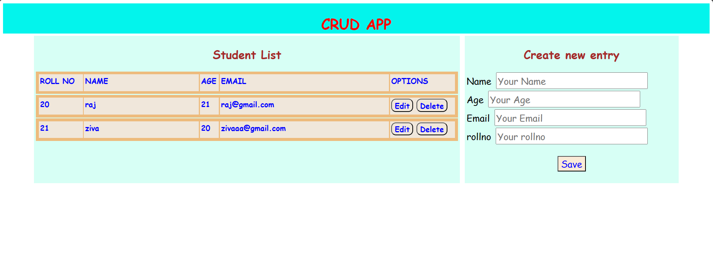
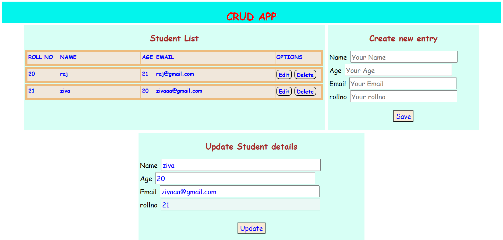

CRUD APP

# Flask 
# Creating virtual environment 
python3 -m venv env

# Activating virtual environment 
./env/Scripts/activate

# To run flask app
flask run

# To create tables using sqlalchemy
flask shell
from app import db
db.create_all()

# To install vue-router 
npm install vue-router@4
- 1.update main.js
- 2.create router.js
- 3.update App.vue

# To connect flask and vue js
npm install axios@1.3.6 --save

# Vue js
npm run serve 

# To create requirements.txt file
pip freeze > requirements.txt

# To install necessary packages in requirements.txt file
pip install -r requirements.txt

## ⭐BASIC CRUD OPERATIONS⭐

#### Main page
  

#### Page for updating the details
  